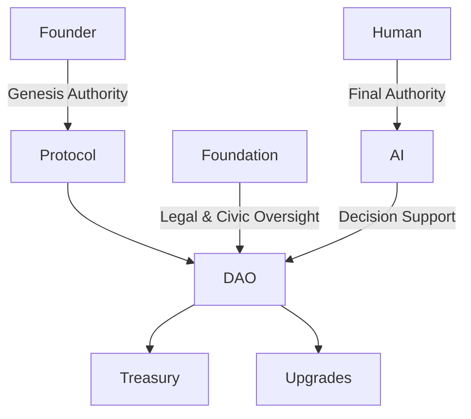

# ⚖️ LEGAL DISCLAIMER & GOVERNANCE APPENDIX

## TEOS Egypt

---

## 1. Project Nature

**TEOS Egypt** is a **civic-first digital infrastructure initiative** designed to explore and prototype next-generation systems for:

* Digital governance
* AI-assisted public services
* Blockchain-based infrastructure
* Smart-city and civic technology use cases

This repository is published **for research, development, education, and civic innovation purposes only**.

---

## 2. No Financial, Legal, or Investment Advice

Nothing contained in this repository — including code, documentation, diagrams, descriptions, or references — constitutes or should be interpreted as:

* Financial or investment advice
* An offer, solicitation, or recommendation to buy, sell, or hold any asset
* Legal, regulatory, or tax advice
* A promise or guarantee of profit, returns, performance, or outcomes

No content herein creates any fiduciary relationship or obligation.

---

## 3. Experimental & "As‑Is" Disclosure

All components of the TEOS Egypt ecosystem — including but not limited to:

* Tokens or digital assets
* Governance mechanisms
* Smart contracts
* APIs and infrastructure
* AI-assisted or automated systems

are **experimental**, **evolving**, and provided **"as-is"**, **without warranties of any kind**, whether express or implied.

Use of this system is at the user’s own risk.

---

## 4. Regulatory & Jurisdictional Responsibility

Participation in or interaction with this system may be subject to:

* Local, national, or international laws
* Digital asset, data protection, AI, or financial regulations

**Users and participants are solely responsible** for understanding and complying with all applicable laws and regulations within their jurisdiction.

TEOS Egypt does not provide compliance assurances or regulatory clearance.

---

## 5. Civic‑First Principles & Governance Acceptance

By accessing, using, or contributing to this repository, you acknowledge and accept the following principles:

* Civic-first and public-interest-oriented design
* Transparency and accountability in governance
* Open-source and non-custodial architecture
* Human-in-the-loop decision-making
* AI as an assistive tool, not a final authority

---

## 📊 GOVERNANCE ARCHITECTURE

### 6. Governance Flow (Conceptual)



---

### 7. Structural Overview

```
          ┌────────────────┐
          │  Constitution  │
          └────────┬───────┘
                   │
        ┌──────────▼──────────┐
        │     Governance       │
        └────────┬─────┬──────┘
                 │     │
           ┌─────▼─┐ ┌─▼──────────┐
           │  DAO   │ │ Foundation │
           └─────┬─┘ └────┬────────┘
                 │        │
           ┌─────▼────────▼─────┐
           │   Infrastructure     │
           └─────────────────────┘
```

---

## 8. Competition & Public Review Note

This project and repository are presented as part of innovation, research, and application showcases — including hackathons, accelerators, and competitions — and **do not represent a commercial launch or regulated financial product**.

---

## 9. Final Statement

TEOS Egypt is an **exploratory civic technology initiative**.

Its purpose is to advance discussion, experimentation, and responsible design in the intersection of **AI, blockchain, governance, and public infrastructure** — not to offer financial products or investment opportunities.

---

© TEOS Egypt — Civic Infrastructure Research Initiative

